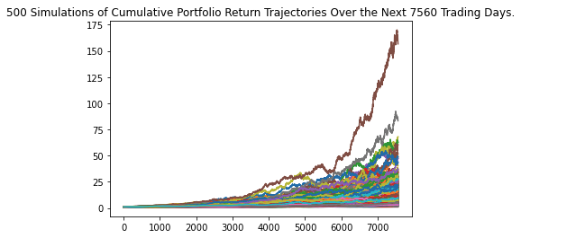
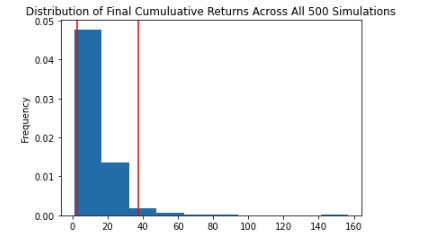

# Financial Planning Tools

This is a JupyterLab application in which a trader or a financial planning company can use their API key(s) to access current market data then use Monte Carlo Simulations to project possible outcomes of their portfolio(s). 

---

## Technologies

# Import the required libraries and dependencies
import os
import requests
import json
import pandas as pd
from dotenv import load_dotenv
import alpaca_trade_api as tradeapi
from MCForecastTools import MCSimulation

%matplotlib inline

This application was written in Python 3.9.12. This application is dependent on the following libraries:
* [pandas](https://pandas.pydata.org/)
* [pandas os](https://docs.python.org/3/library/os.html)
* [pandas requests](https://realpython.com/python-requests/)
* [pandas json](https://docs.python.org/3/library/json.html)
* [python-dotenv](https://pypi.org/project/python-dotenv/)
* [alpaca trade api](https://pypi.org/project/alpaca-trade-api/)
* [monte carlo forecast tools](https://pbpython.com/monte-carlo.html)
* [matplotlib](https://matplotlib.org/)
* [JupyterLab](https://jupyter.org/)

---

## Installation Guide

If you have [Anaconda](https://www.anaconda.com/products/distribution) downloaded, then pandas and JupyterLab, os, requests, and matplotlib will be part of your package. You can check that they're ready to use by typing the following in your CLI terminal:
```python
conda list pandas
conda list os
conda list requests
conda list json
conda list matplotlib
conda list jupyter lab
```

You'll need to install python-dotenv and alpaca-trade-api.
```python
pip install python-dotenv
pip install alpaca-trade-api
pip install forecast-tools
```

---

## Usage

Open your CLI terminal and type
```python
jupyter lab -ContentsManager.allow_hidden=True
```
then JupyterLab will automatically open in your browswer. Use the left side menu bar to search for the `financial_planning_tools.ipynb` file. Open this file. Inside the same folder, create a new text file, add your personal api key(s), then same the file as `.env`. The file will disappear, but you can click VIEW > SHOW HIDDEN FILES and you will be able to see it. This file hides your api key(s) safely. Then you can use the formaulas in the `.ipynb` file to analyze your portfolio(s) and whichever dates you need to check.

See an example of a Monte Carlo Simulation Plot here:



See an example of a Monte Carlo Distribution Plot here:



---

## Contributors

[Rachel Ann Hodson](https://www.linkedin.com/in/rachelannhodson/), rachelannhodson@gmail.com

---

## License

MIT